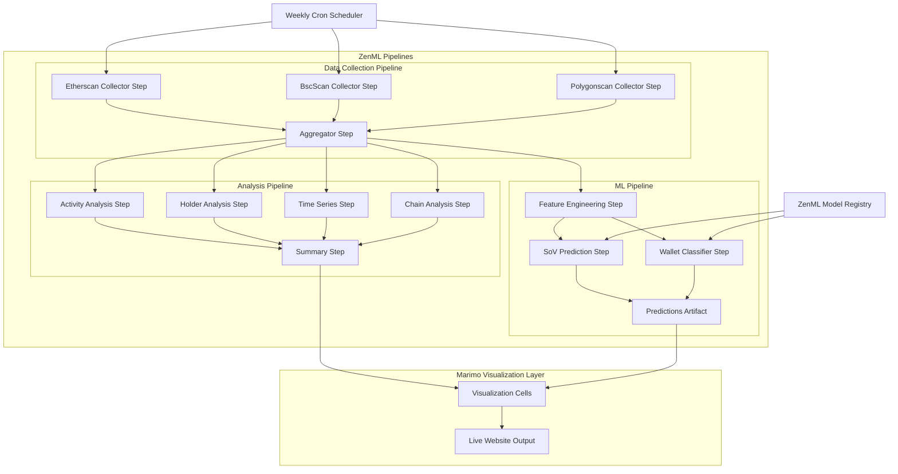

# Design Document: Stablecoin Analysis Notebook with ZenML Integration

## Overview

This document describes the design for a marimo Python notebook integrated with ZenML that analyzes stablecoin transaction data and provides predictive ML capabilities. The system determines whether users primarily use stablecoins (USDC, USDT) for everyday transactions or as a store of value, and predicts future holder behavior.

**Key Design Decisions:**
- **ZenML** serves as the unified orchestration framework for data collection, analysis, and ML pipelines
- **Marimo** provides the interactive notebook interface and visualization layer for pipeline outputs
- **Scheduled Execution**: Weekly cron jobs trigger the master pipeline for live website updates
- **ML Models**: Binary classification for SoV prediction, multi-class for wallet behavior classification

## Architecture

The system follows a pipeline-oriented architecture with ZenML orchestrating all workflows:



The marimo notebook serves dual purposes:
1. **Interactive Development**: Trigger pipelines, explore data, tune models
2. **Visualization Layer**: Display pipeline outputs for the live website

## Components and Interfaces

### 1. Data Loading Module

```python
@dataclass
class LoadedData:
    """Container for loaded and validated stablecoin data."""
    metadata: dict
    transactions_df: pd.DataFrame
    holders_df: pd.DataFrame
    summary: dict
    errors: list[str]
    is_sample_data: bool = False

def load_json_file(file_path: str) -> LoadedData:
    """Load and validate JSON export file."""
    ...

def validate_schema(data: dict) -> tuple[bool, list[str]]:
    """Validate JSON structure against expected schema."""
    ...
```

### 2. Analysis Engine

```python
@dataclass
class ActivityBreakdown:
    """Activity type distribution metrics."""
    counts: dict[str, int]
    percentages: dict[str, float]
    volumes: dict[str, Decimal]
    volume_percentages: dict[str, float]

@dataclass
class HolderMetrics:
    """Holder behavior metrics."""
    total_holders: int
    sov_count: int
    sov_percentage: float
    avg_balance_sov: Decimal
    avg_balance_active: Decimal
    avg_holding_period_days: float
    median_holding_period_days: float

@dataclass
class ChainMetrics:
    """Per-chain analysis metrics."""
    chain: str
    transaction_count: int
    total_volume: Decimal
    avg_transaction_size: Decimal
    avg_gas_cost: Optional[Decimal]
    sov_ratio: float
    activity_distribution: dict[str, float]

@dataclass
class AnalysisResults:
    """Complete analysis results container."""
    activity_breakdown: ActivityBreakdown
    by_stablecoin: dict[str, ActivityBreakdown]
    holder_metrics: HolderMetrics
    chain_metrics: list[ChainMetrics]
    time_series: pd.DataFrame
    conclusions: dict

def analyze_activity_types(df: pd.DataFrame) -> ActivityBreakdown:
    """Calculate activity type distribution."""
    ...

def analyze_holders(holders_df: pd.DataFrame, transactions_df: pd.DataFrame) -> HolderMetrics:
    """Analyze holder behavior patterns."""
    ...

def analyze_by_chain(df: pd.DataFrame) -> list[ChainMetrics]:
    """Calculate per-chain metrics."""
    ...

def analyze_time_series(df: pd.DataFrame, aggregation: str) -> pd.DataFrame:
    """Create time-series aggregations."""
    ...
```

### 3. Visualization Layer

```python
def create_activity_pie_chart(breakdown: ActivityBreakdown) -> alt.Chart:
    """Create interactive pie chart for activity distribution."""
    ...

def create_stablecoin_comparison_chart(by_stablecoin: dict) -> alt.Chart:
    """Create grouped bar chart comparing stablecoins."""
    ...

def create_holder_histogram(holders_df: pd.DataFrame) -> alt.Chart:
    """Create histogram of holder balances by SoV status."""
    ...

def create_time_series_chart(ts_df: pd.DataFrame, metric: str) -> alt.Chart:
    """Create line chart for time series analysis."""
    ...

def create_chain_comparison_chart(chain_metrics: list[ChainMetrics]) -> alt.Chart:
    """Create stacked bar chart for chain comparison."""
    ...
```

### 4. Sample Data Generator

```python
@dataclass
class SampleDataConfig:
    """Configuration for sample data generation."""
    num_transactions: int = 1000
    num_holders: int = 100
    stablecoins: list[str] = field(default_factory=lambda: ["USDC", "USDT"])
    chains: list[str] = field(default_factory=lambda: ["ethereum", "bsc", "polygon"])
    sov_ratio: float = 0.3  # 30% store of value
    date_range_days: int = 90

def generate_sample_data(config: SampleDataConfig) -> LoadedData:
    """Generate synthetic sample data for testing."""
    ...
```

### 5. ZenML Pipeline Components

```python
from zenml import step, pipeline
from zenml.client import Client
from typing import Tuple, Annotated
import pandas as pd

# ============== Data Collection Steps ==============

@step
def etherscan_collector_step(
    stablecoins: list[str],
    date_range_days: int,
) -> Annotated[pd.DataFrame, "etherscan_data"]:
    """Collect stablecoin data from Etherscan API.
    
    Wraps the existing EtherscanCollector as a ZenML step.
    """
    from collectors.etherscan import EtherscanCollector
    collector = EtherscanCollector()
    # ... collection logic
    return transactions_df

@step
def bscscan_collector_step(
    stablecoins: list[str],
    date_range_days: int,
) -> Annotated[pd.DataFrame, "bscscan_data"]:
    """Collect stablecoin data from BscScan API."""
    from collectors.bscscan import BscScanCollector
    # ... collection logic
    return transactions_df

@step
def polygonscan_collector_step(
    stablecoins: list[str],
    date_range_days: int,
) -> Annotated[pd.DataFrame, "polygonscan_data"]:
    """Collect stablecoin data from Polygonscan API."""
    from collectors.polygonscan import PolygonscanCollector
    # ... collection logic
    return transactions_df

@step
def aggregate_data_step(
    etherscan_data: pd.DataFrame,
    bscscan_data: pd.DataFrame,
    polygonscan_data: pd.DataFrame,
) -> Tuple[
    Annotated[pd.DataFrame, "transactions"],
    Annotated[pd.DataFrame, "holders"],
]:
    """Merge and deduplicate data from all collectors."""
    from collectors.aggregator import DataAggregator
    aggregator = DataAggregator()
    # ... aggregation logic
    return transactions_df, holders_df

# ============== Analysis Steps ==============

@step
def activity_analysis_step(
    transactions: pd.DataFrame,
) -> Annotated[dict, "activity_breakdown"]:
    """Calculate activity type distribution."""
    breakdown = analyze_activity_types(transactions)
    return breakdown.to_dict()

@step
def holder_analysis_step(
    holders: pd.DataFrame,
    transactions: pd.DataFrame,
) -> Annotated[dict, "holder_metrics"]:
    """Analyze holder behavior patterns."""
    metrics = analyze_holders(holders, transactions)
    return metrics.to_dict()

@step
def time_series_step(
    transactions: pd.DataFrame,
    aggregation: str = "daily",
) -> Annotated[pd.DataFrame, "time_series"]:
    """Create time-series aggregations."""
    return analyze_time_series(transactions, aggregation)

@step
def chain_analysis_step(
    transactions: pd.DataFrame,
) -> Annotated[list, "chain_metrics"]:
    """Calculate per-chain metrics."""
    metrics = analyze_by_chain(transactions)
    return [m.to_dict() for m in metrics]

# ============== ML Steps ==============

@step
def feature_engineering_step(
    transactions: pd.DataFrame,
    holders: pd.DataFrame,
) -> Annotated[pd.DataFrame, "features"]:
    """Extract ML features from transaction and holder data.
    
    Features include:
    - transaction_count: Total transactions for holder
    - avg_transaction_size: Mean transaction amount
    - balance_percentile: Holder's balance rank (0-100)
    - holding_period_days: Days since first activity
    - activity_recency_days: Days since last activity
    - transaction_frequency: Transactions per day
    - balance_volatility: Std dev of balance changes
    - cross_chain_flag: Whether holder active on multiple chains
    """
    # ... feature extraction logic
    return features_df

@step
def train_sov_predictor_step(
    features: pd.DataFrame,
    holders: pd.DataFrame,
) -> Annotated[object, "sov_model"]:
    """Train binary classifier to predict SoV behavior.
    
    Target: is_store_of_value (boolean)
    Algorithm: XGBoost or RandomForest
    """
    from sklearn.ensemble import RandomForestClassifier
    # ... training logic
    return model

@step
def train_wallet_classifier_step(
    features: pd.DataFrame,
) -> Annotated[object, "wallet_classifier"]:
    """Train multi-class classifier for wallet behavior.
    
    Classes: trader, holder, whale, retail
    Algorithm: XGBoost or RandomForest
    """
    # ... training logic
    return model

@step
def predict_sov_step(
    features: pd.DataFrame,
    model: object,
) -> Annotated[pd.DataFrame, "sov_predictions"]:
    """Run SoV prediction inference."""
    predictions = model.predict_proba(features)
    return pd.DataFrame({
        'address': features['address'],
        'sov_probability': predictions[:, 1],
    })

@step
def classify_wallets_step(
    features: pd.DataFrame,
    model: object,
) -> Annotated[pd.DataFrame, "wallet_classifications"]:
    """Run wallet behavior classification."""
    predictions = model.predict(features)
    probabilities = model.predict_proba(features)
    return pd.DataFrame({
        'address': features['address'],
        'behavior_class': predictions,
        'confidence': probabilities.max(axis=1),
    })

# ============== Pipeline Definitions ==============

@pipeline
def data_collection_pipeline(
    stablecoins: list[str] = ["USDC", "USDT"],
    date_range_days: int = 7,
):
    """Pipeline to collect data from all blockchain explorers."""
    eth_data = etherscan_collector_step(stablecoins, date_range_days)
    bsc_data = bscscan_collector_step(stablecoins, date_range_days)
    poly_data = polygonscan_collector_step(stablecoins, date_range_days)
    transactions, holders = aggregate_data_step(eth_data, bsc_data, poly_data)
    return transactions, holders

@pipeline
def analysis_pipeline(
    transactions: pd.DataFrame,
    holders: pd.DataFrame,
):
    """Pipeline to run all analysis steps."""
    activity = activity_analysis_step(transactions)
    holder_metrics = holder_analysis_step(holders, transactions)
    time_series = time_series_step(transactions)
    chain_metrics = chain_analysis_step(transactions)
    return activity, holder_metrics, time_series, chain_metrics

@pipeline
def ml_training_pipeline(
    transactions: pd.DataFrame,
    holders: pd.DataFrame,
):
    """Pipeline to train ML models."""
    features = feature_engineering_step(transactions, holders)
    sov_model = train_sov_predictor_step(features, holders)
    wallet_model = train_wallet_classifier_step(features)
    return sov_model, wallet_model

@pipeline
def ml_inference_pipeline(
    transactions: pd.DataFrame,
    holders: pd.DataFrame,
):
    """Pipeline to run ML inference with production models."""
    features = feature_engineering_step(transactions, holders)
    # Load production models from registry
    client = Client()
    sov_model = client.get_artifact("sov_model", version="production")
    wallet_model = client.get_artifact("wallet_classifier", version="production")
    sov_predictions = predict_sov_step(features, sov_model)
    wallet_classes = classify_wallets_step(features, wallet_model)
    return sov_predictions, wallet_classes

@pipeline
def master_pipeline(
    stablecoins: list[str] = ["USDC", "USDT"],
    date_range_days: int = 7,
):
    """Master pipeline orchestrating collection, analysis, and ML inference.
    
    This is the pipeline triggered by weekly cron jobs.
    """
    # Data collection
    eth_data = etherscan_collector_step(stablecoins, date_range_days)
    bsc_data = bscscan_collector_step(stablecoins, date_range_days)
    poly_data = polygonscan_collector_step(stablecoins, date_range_days)
    transactions, holders = aggregate_data_step(eth_data, bsc_data, poly_data)
    
    # Analysis
    activity = activity_analysis_step(transactions)
    holder_metrics = holder_analysis_step(holders, transactions)
    time_series = time_series_step(transactions)
    chain_metrics = chain_analysis_step(transactions)
    
    # ML inference
    features = feature_engineering_step(transactions, holders)
@pipeline
def master_pipeline(
    stablecoins: list[str] = ["USDC", "USDT"],
    date_range_days: int = 7,
):
    """Master pipeline orchestrating collection, analysis, and ML inference.
    
    This is the pipeline triggered by weekly cron jobs.
    """
    # Data collection
    eth_data = etherscan_collector_step(stablecoins, date_range_days)
    bsc_data = bscscan_collector_step(stablecoins, date_range_days)
    poly_data = polygonscan_collector_step(stablecoins, date_range_days)
    transactions, holders = aggregate_data_step(eth_data, bsc_data, poly_data)
    
    # Analysis
    activity = activity_analysis_step(transactions)
    holder_metrics = holder_analysis_step(holders, transactions)
    time_series = time_series_step(transactions)
    chain_metrics = chain_analysis_step(transactions)
    
    # ML inference
    features = feature_engineering_step(transactions, holders)
    # Load production models from registry
    client = Client()
    sov_model = client.get_artifact_version("sov_model", version="production")
    wallet_model = client.get_artifact_version("wallet_classifier", version="production")
    sov_predictions = predict_sov_step(features, sov_model)
    wallet_classes = classify_wallets_step(features, wallet_model)
    
    return {
        "activity": activity,
        "holder_metrics": holder_metrics,
        "time_series": time_series,
        "chain_metrics": chain_metrics,
        "sov_predictions": sov_predictions,
        "wallet_classifications": wallet_classes,
    }
    
    return {
        "activity": activity,
        "holder_metrics": holder_metrics,
        "time_series": time_series,
        "chain_metrics": chain_metrics,
        "sov_predictions": sov_predictions,
        "wallet_classifications": wallet_classes,
    }
```

### 6. Marimo-ZenML Integration Layer

```python
from zenml.client import Client

class ZenMLNotebookBridge:
    """Bridge between marimo notebook and ZenML pipelines."""
    
    def __init__(self):
        self.client = Client()
    
    def list_pipelines(self) -> list[dict]:
        """List available ZenML pipelines with status."""
        pipelines = self.client.list_pipelines()
        return [
            {
                "name": p.name,
                "last_run": p.runs[-1].created if p.runs else None,
                "status": p.runs[-1].status if p.runs else "never_run",
            }
            for p in pipelines
        ]
    
    def trigger_pipeline(
        self,
        pipeline_name: str,
        parameters: dict,
    ) -> str:
        """Trigger a pipeline run and return run_id."""
        pipeline = self.client.get_pipeline(pipeline_name)
        run = pipeline.run(**parameters)
        return run.id
    
    def get_run_status(self, run_id: str) -> dict:
        """Get status of a pipeline run."""
        run = self.client.get_pipeline_run(run_id)
        return {
            "status": run.status,
            "steps": {
                step.name: step.status
                for step in run.steps
            },
        }
    
    def load_latest_artifacts(self) -> dict:
        """Load artifacts from the latest successful master pipeline run."""
        runs = self.client.list_pipeline_runs(
            pipeline_name="master_pipeline",
            status="completed",
            sort_by="desc:created",
        )
        if not runs:
            return None
        
        latest_run = runs[0]
        
        # Load artifacts using ZenML standard pattern:
        # pipeline_run.steps["step_name"].outputs["artifact_name"].load()
        return {
            "activity": latest_run.steps["activity_analysis_step"].outputs["activity_breakdown"].load(),
            "holder_metrics": latest_run.steps["holder_analysis_step"].outputs["holder_metrics"].load(),
            "time_series": latest_run.steps["time_series_step"].outputs["time_series"].load(),
            "chain_metrics": latest_run.steps["chain_analysis_step"].outputs["chain_metrics"].load(),
            "sov_predictions": latest_run.steps["predict_sov_step"].outputs["sov_predictions"].load(),
            "wallet_classifications": latest_run.steps["classify_wallets_step"].outputs["wallet_classifications"].load(),
            "run_metadata": {
                "run_id": latest_run.id,
                "created": latest_run.created,
            },
        }
    
    def get_model_versions(self, model_name: str) -> list[dict]:
        """List all versions of a model with metrics."""
        versions = self.client.list_model_versions(model_name)
        return [
            {
                "version": v.version,
                "created": v.created,
                "metrics": v.metadata.get("metrics", {}),
                "is_production": v.stage == "production",
            }
            for v in versions
        ]
    
    def promote_model(self, model_name: str, version: str) -> None:
        """Promote a model version to production."""
        self.client.update_model_version(
            model_name,
            version,
            stage="production",
        )
```

### 7. ML Model Specifications

#### SoV Prediction Model

```python
@dataclass
class SoVModelConfig:
    """Configuration for Store-of-Value prediction model."""
    algorithm: str = "random_forest"  # or "xgboost"
    n_estimators: int = 100
    max_depth: int = 10
    min_samples_split: int = 5
    class_weight: str = "balanced"  # Handle imbalanced classes
    
@dataclass
class SoVFeatures:
    """Features for SoV prediction.
    
    All features are computed per-holder from transaction history.
    """
    transaction_count: int
    avg_transaction_size: Decimal
    total_volume: Decimal
    balance: Decimal
    balance_percentile: float  # 0-100
    holding_period_days: int
    activity_recency_days: int
    transaction_frequency: float  # tx per day
    incoming_ratio: float  # incoming / total transactions
    unique_counterparties: int
    cross_chain_flag: bool

@dataclass
class SoVPrediction:
    """Output of SoV prediction."""
    address: str
    sov_probability: float  # 0.0 to 1.0
    predicted_class: bool  # True = will become SoV
    confidence: float
```

#### Wallet Behavior Classifier

```python
from enum import Enum

class WalletBehaviorClass(str, Enum):
    """Wallet behavior classification categories."""
    TRADER = "trader"      # High frequency, low holding period
    HOLDER = "holder"      # Low frequency, high holding period
    WHALE = "whale"        # High balance (top 1%), any pattern
    RETAIL = "retail"      # Low balance, moderate activity

@dataclass
class WalletClassifierConfig:
    """Configuration for wallet behavior classifier."""
    algorithm: str = "random_forest"
    n_estimators: int = 100
    whale_threshold_percentile: float = 99.0  # Top 1% = whale
    trader_frequency_threshold: float = 1.0   # >1 tx/day = trader
    holder_period_threshold_days: int = 30    # >30 days = holder

@dataclass
class WalletClassification:
    """Output of wallet classification."""
    address: str
    behavior_class: WalletBehaviorClass
    confidence: float
    class_probabilities: dict[str, float]
```

### 8. Summary Generator

```python
from enum import Enum

class ConfidenceLevel(str, Enum):
    """Confidence level for analysis conclusions.
    
    Inherits from str to enable JSON serialization as string values.
    Use .value for string representation, e.g., ConfidenceLevel.HIGH.value == "high"
    """
    HIGH = "high"
    MEDIUM = "medium"
    LOW = "low"
    
    @classmethod
    def from_score(cls, score: float) -> "ConfidenceLevel":
        """Map confidence score to level based on thresholds.
        
        Args:
            score: Confidence score between 0.0 and 1.0
            
        Returns:
            ConfidenceLevel.HIGH if score >= 0.85
            ConfidenceLevel.MEDIUM if 0.50 <= score < 0.85
            ConfidenceLevel.LOW if score < 0.50
        """
        if score >= 0.85:
            return cls.HIGH
        elif score >= 0.50:
            return cls.MEDIUM
        else:
            return cls.LOW

@dataclass
class Conclusion:
    """Analysis conclusion with confidence."""
    finding: str
    value: str
    confidence: ConfidenceLevel
    explanation: str
    
    def to_dict(self) -> dict:
        """Serialize to dictionary with confidence as string value."""
        return {
            "finding": self.finding,
            "value": self.value,
            "confidence": self.confidence.value,  # Serialize enum to string
            "explanation": self.explanation,
        }
    
    @classmethod
    def from_dict(cls, data: dict) -> "Conclusion":
        """Deserialize from dictionary, mapping string to ConfidenceLevel."""
        return cls(
            finding=data["finding"],
            value=data["value"],
            confidence=ConfidenceLevel(data["confidence"]),  # Parse string to enum
            explanation=data["explanation"],
        )

# System constant: supported chains (fixed requirement)
# The system supports exactly 3 chains: ethereum, bsc, polygon
# This is a fixed architectural constraint matching the blockchain explorer collectors
SUPPORTED_CHAINS: list[str] = ["ethereum", "bsc", "polygon"]
SUPPORTED_CHAIN_COUNT: int = 3  # len(SUPPORTED_CHAINS), used for chain coverage calculation

@dataclass
class ConfidenceMetrics:
    """Metrics used for confidence calculation.
    
    Note: chain_coverage is calculated as chains_with_data / SUPPORTED_CHAIN_COUNT,
    where SUPPORTED_CHAIN_COUNT is fixed at 3 (ethereum, bsc, polygon). This is a
    system-wide architectural constraint matching the blockchain explorer collectors.
    """
    sample_size: int
    completeness_percent: float
    chain_coverage: float  # chains_with_data / SUPPORTED_CHAIN_COUNT (3)
    chains_with_data: int  # count of unique chains present in dataset
    confidence_score: float
    confidence_level: ConfidenceLevel
    
    def to_dict(self) -> dict:
        """Serialize to dictionary with confidence_level as string value."""
        return {
            "sample_size": self.sample_size,
            "completeness_percent": self.completeness_percent,
            "chain_coverage": self.chain_coverage,
            "chains_with_data": self.chains_with_data,
            "confidence_score": self.confidence_score,
            "confidence_level": self.confidence_level.value,
        }

def generate_conclusions(results: AnalysisResults, data: LoadedData) -> list[Conclusion]:
    """Generate summary conclusions from analysis.
    
    Returns:
        List of Conclusion objects with ConfidenceLevel enum values.
    """
    ...

def calculate_confidence(data: LoadedData) -> ConfidenceMetrics:
    """Calculate confidence level based on data quality.
    
    Step 1 - Calculate Component Metrics:
        sample_size = len(transactions_df)
        
        field_completeness = (non_null_required_fields / total_required_fields)
            where required_fields = [transaction_hash, timestamp, amount, 
                                     stablecoin, chain, activity_type]
        
        chain_coverage = chains_with_data / SUPPORTED_CHAIN_COUNT
            where SUPPORTED_CHAIN_COUNT = 3 (ethereum, bsc, polygon)
    
    Step 2 - Combine into Completeness Percent:
        completeness_percent = 0.7 * field_completeness + 0.3 * chain_coverage
        
        This weights field completeness (70%) higher than chain coverage (30%)
        because having complete data is more important than having all chains.
    
    Step 3 - Calculate Final Confidence Score:
        normalized_sample_size = min(sample_size / 1000, 1.0)
        confidence_score = 0.6 * normalized_sample_size + 0.4 * completeness_percent
    
    Step 4 - Map to Confidence Level (via ConfidenceLevel.from_score):
        - HIGH: score >= 0.85
        - MEDIUM: 0.50 <= score < 0.85
        - LOW: score < 0.50
    
    Example Calculation:
        Given: 500 transactions, 95% field completeness, 2 chains with data
        
        chain_coverage = 2 / 3 = 0.667
        completeness_percent = 0.7 * 0.95 + 0.3 * 0.667 = 0.665 + 0.200 = 0.865
        normalized_sample_size = min(500 / 1000, 1.0) = 0.5
        confidence_score = 0.6 * 0.5 + 0.4 * 0.865 = 0.3 + 0.346 = 0.646
        confidence_level = MEDIUM (0.50 <= 0.646 < 0.85)
    
    Note: chain_coverage is stored separately in ConfidenceMetrics for transparency,
    but it is incorporated into completeness_percent for the final score calculation.
    
    Returns:
        ConfidenceMetrics with all component values and final confidence_level.
    """
    ...
```

## Data Models

### Input JSON Schema (from exporter)

```json
{
  "metadata": {
    "run_id": "string",
    "collection_timestamp": "ISO8601 datetime",
    "agent_version": "string",
    "explorers_queried": ["string"],
    "total_records": "integer"
  },
  "summary": {
    "by_stablecoin": {
      "USDC": { "transaction_count": 0, "total_volume": "0", ... },
      "USDT": { ... }
    },
    "by_activity_type": { "transaction": 0, "store_of_value": 0, "other": 0 },
    "by_chain": { "ethereum": 0, "bsc": 0, "polygon": 0 }
  },
  "transactions": [
    {
      "transaction_hash": "string",
      "block_number": "integer",
      "timestamp": "ISO8601 datetime",
      "from_address": "string",
      "to_address": "string",
      "amount": "decimal string",
      "stablecoin": "USDC|USDT",
      "chain": "ethereum|bsc|polygon",
      "activity_type": "transaction|store_of_value|other",
      "source_explorer": "string",
      "gas_used": "integer|null",
      "gas_price": "decimal string|null"
    }
  ],
  "holders": [
    {
      "address": "string",
      "balance": "decimal string",
      "stablecoin": "USDC|USDT",
      "chain": "ethereum|bsc|polygon",
      "first_seen": "ISO8601 datetime",
      "last_activity": "ISO8601 datetime",
      "is_store_of_value": "boolean",
      "source_explorer": "string"
    }
  ],
  "errors": ["string"]  // optional
}
```

### Transactions DataFrame Schema

| Column | Type | Description |
|--------|------|-------------|
| transaction_hash | str | Unique transaction identifier |
| block_number | int | Block number |
| timestamp | datetime | Transaction timestamp |
| from_address | str | Sender address |
| to_address | str | Receiver address |
| amount | Decimal | Transaction amount |
| stablecoin | str | Token type (USDC/USDT) |
| chain | str | Blockchain network |
| activity_type | str | Classification |
| gas_used | int | Gas consumed (nullable) |
| gas_price | Decimal | Gas price (nullable) |

### Holders DataFrame Schema

| Column | Type | Description |
|--------|------|-------------|
| address | str | Wallet address |
| balance | Decimal | Current balance |
| stablecoin | str | Token type |
| chain | str | Blockchain network |
| first_seen | datetime | First activity date |
| last_activity | datetime | Last activity date |
| holding_period_days | int | Days since last activity |
| is_store_of_value | bool | SoV classification |

## Correctness Properties

*A property is a characteristic or behavior that should hold true across all valid executions of a system-essentially, a formal statement about what the system should do. Properties serve as the bridge between human-readable specifications and machine-verifiable correctness guarantees.*

### Property 1: Schema validation round-trip
*For any* valid JSON data structure (real or generated), parsing and validation SHALL succeed and preserve all required fields without data loss.
**Validates: Requirements 1.2, 8.2**

### Property 2: Grouping preserves totals
*For any* transactions DataFrame, grouping by any dimension (activity_type, stablecoin, chain) and summing counts SHALL equal the total transaction count, and summing volumes SHALL equal the total volume.
**Validates: Requirements 2.1, 3.1, 6.1**

### Property 3: Percentages sum to 100
*For any* percentage breakdown calculation (activity types, holder classifications), the sum of all percentages SHALL equal 100% (within floating-point tolerance).
**Validates: Requirements 2.1, 4.1**

### Property 4: Volume calculation consistency
*For any* transactions DataFrame, the sum of volumes by activity type SHALL equal the sum of volumes by stablecoin SHALL equal the sum of volumes by chain SHALL equal total volume.
**Validates: Requirements 2.3, 3.1, 6.1**

### Property 5: Average calculation correctness
*For any* non-empty group of transactions, the calculated average transaction size SHALL equal the sum of amounts divided by the count of transactions.
**Validates: Requirements 3.3, 6.3**

### Property 6: Holder classification consistency
*For any* holders DataFrame, the count of is_store_of_value=True plus is_store_of_value=False SHALL equal total holder count.
**Validates: Requirements 4.1**

### Property 7: Top-N ordering correctness
*For any* holders DataFrame and N <= total holders, the top N holders by balance SHALL be sorted in descending order by balance.
**Validates: Requirements 4.4**

### Property 8: Time aggregation preserves totals
*For any* transactions DataFrame and aggregation period (daily/weekly/monthly), the sum of aggregated counts SHALL equal total transaction count.
**Validates: Requirements 5.1, 5.4**

### Property 9: Sample data schema compliance
*For any* sample data configuration, generated data SHALL pass the same schema validation as real exported data.
**Validates: Requirements 8.2**

### Property 10: Sample data respects configuration
*For any* sample data configuration specifying N transactions and M holders, generated data SHALL contain exactly N transactions and M holders.
**Validates: Requirements 8.4**

### Property 11: Confidence calculation bounds
*For any* dataset, the calculated confidence indicator SHALL be a valid ConfidenceLevel enum value (HIGH, MEDIUM, or LOW) based on the formula: confidence_score = 0.6 × min(sample_size/1000, 1.0) + 0.4 × completeness_percent, mapped via ConfidenceLevel.from_score() where HIGH (score ≥ 0.85), MEDIUM (0.50 ≤ score < 0.85), LOW (score < 0.50).
**Validates: Requirements 7.3**

### Property 12: Error detection completeness
*For any* JSON data containing an "errors" array with non-empty entries, the data quality warnings SHALL include at least one warning.
**Validates: Requirements 7.4**

### Property 13: ZenML step output typing
*For any* ZenML collector step execution, the output artifact SHALL be a valid pandas DataFrame with the required transaction schema columns.
**Validates: Requirements 9.1, 9.2**

### Property 14: Aggregation preserves records
*For any* set of collector outputs, the aggregated result SHALL contain all unique transactions from all sources (deduplication by transaction_hash).
**Validates: Requirements 9.3**

### Property 15: Pipeline artifact versioning
*For any* completed pipeline run, all output artifacts SHALL be retrievable by run_id and artifact name from the ZenML artifact store.
**Validates: Requirements 10.2**

### Property 16: Feature engineering completeness
*For any* holder with transaction history, the feature engineering step SHALL produce a feature vector with all required fields (transaction_count, avg_transaction_size, balance_percentile, holding_period_days, activity_recency_days, transaction_frequency, balance_volatility, cross_chain_flag).
**Validates: Requirements 11.1, 12.2**

### Property 17: SoV prediction probability bounds
*For any* holder, the SoV prediction probability SHALL be in the range [0.0, 1.0].
**Validates: Requirements 11.5**

### Property 18: Wallet classification exclusivity
*For any* holder, the wallet classifier SHALL assign exactly one behavior class from {trader, holder, whale, retail}.
**Validates: Requirements 12.4**

### Property 19: Model metrics validity
*For any* trained model, the evaluation metrics (precision, recall, F1, AUC) SHALL each be in the range [0.0, 1.0].
**Validates: Requirements 11.3, 15.2**

### Property 20: Pipeline trigger returns run_id
*For any* pipeline trigger from the notebook, the system SHALL return a valid run_id that can be used to query status.
**Validates: Requirements 13.2**

## Error Handling

### Data Loading Errors
- **File not found**: Display error message with file path, suggest checking output directory
- **Invalid JSON**: Display parse error with line number if available
- **Schema validation failure**: List missing/invalid fields, suggest re-running data collection
- **Empty data**: Warn user, offer to generate sample data instead

### Analysis Errors
- **Division by zero**: Handle empty groups gracefully, return 0 or N/A
- **Missing columns**: Skip affected analysis, display warning
- **Invalid timestamps**: Parse with error handling, exclude invalid records with warning

### Visualization Errors
- **Empty data for chart**: Display placeholder message instead of empty chart
- **Too many categories**: Aggregate small categories into "Other"

## Testing Strategy

### Property-Based Testing

The notebook will use **Hypothesis** as the property-based testing library for Python. Each correctness property will be implemented as a Hypothesis test with a minimum of 100 iterations.

Property tests will be located in `tests/test_notebook_properties.py` and tagged with the property number they validate.

Example structure:
```python
from hypothesis import given, strategies as st, settings

@settings(max_examples=100)
@given(transactions=transaction_strategy())
def test_grouping_preserves_totals(transactions):
    """
    **Feature: stablecoin-analysis-notebook, Property 2: Grouping preserves totals**
    """
    df = pd.DataFrame(transactions)
    total = len(df)
    by_activity = df.groupby('activity_type').size().sum()
    by_stablecoin = df.groupby('stablecoin').size().sum()
    by_chain = df.groupby('chain').size().sum()
    assert by_activity == total
    assert by_stablecoin == total
    assert by_chain == total
```

### Unit Tests

Unit tests will cover:
- JSON schema validation with specific valid/invalid examples
- DataFrame conversion edge cases
- Visualization component creation
- Sample data generator output
- ZenML step input/output validation
- ML feature engineering correctness
- Model prediction bounds

### ZenML Pipeline Tests

Pipeline tests will verify:
- Step execution order and dependencies
- Artifact serialization/deserialization
- Pipeline parameterization
- Error handling and partial failure recovery

Example ZenML test:
```python
def test_collector_step_output_schema():
    """
    **Feature: stablecoin-analysis-notebook, Property 13: ZenML step output typing**
    """
    # Run collector step with test data
    result = etherscan_collector_step.entrypoint(
        stablecoins=["USDC"],
        date_range_days=1,
    )
    assert isinstance(result, pd.DataFrame)
    required_cols = {'transaction_hash', 'timestamp', 'amount', 'stablecoin', 'chain'}
    assert required_cols.issubset(set(result.columns))
```

### ML Model Tests

ML tests will cover:
- Feature engineering produces valid feature vectors
- Model predictions are within valid bounds
- Classification assigns exactly one class per sample
- Model metrics are computed correctly

Example ML property test:
```python
@settings(max_examples=100)
@given(features=feature_vector_strategy())
def test_sov_prediction_bounds(features):
    """
    **Feature: stablecoin-analysis-notebook, Property 17: SoV prediction probability bounds**
    """
    model = load_test_model("sov_predictor")
    predictions = model.predict_proba(features)
    assert all(0.0 <= p <= 1.0 for p in predictions[:, 1])
```

### Test Data Strategies

Hypothesis strategies for generating test data:
- `transaction_strategy()`: Generate valid transaction records
- `holder_strategy()`: Generate valid holder records
- `json_export_strategy()`: Generate complete valid JSON exports
- `malformed_json_strategy()`: Generate invalid JSON for error testing
- `feature_vector_strategy()`: Generate valid ML feature vectors
- `wallet_behavior_strategy()`: Generate holders with known behavior patterns for classifier testing
