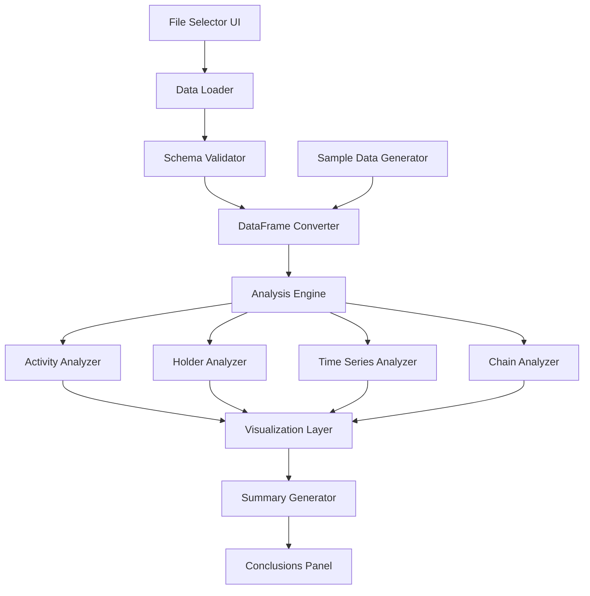

# Design Document: Stablecoin Analysis Notebook

## Overview

This document describes the design for a marimo Python notebook that analyzes stablecoin transaction data to determine whether users primarily use stablecoins (USDC, USDT) for everyday transactions or as a store of value. The notebook consumes JSON export files generated by the blockchain explorer data collection agents and provides interactive visualizations and statistical analysis.

Marimo is chosen as the notebook framework because it creates reproducible, reactive notebooks stored as pure Python scripts, making them version-control friendly and suitable for production data analysis workflows.

## Architecture

The notebook follows a layered architecture with clear separation between data loading, analysis, and visualization:



The notebook is structured as a single marimo Python file with reactive cells that automatically update when dependencies change.

## Components and Interfaces

### 1. Data Loading Module

```python
@dataclass
class LoadedData:
    """Container for loaded and validated stablecoin data."""
    metadata: dict
    transactions_df: pd.DataFrame
    holders_df: pd.DataFrame
    summary: dict
    errors: list[str]
    is_sample_data: bool = False

def load_json_file(file_path: str) -> LoadedData:
    """Load and validate JSON export file."""
    ...

def validate_schema(data: dict) -> tuple[bool, list[str]]:
    """Validate JSON structure against expected schema."""
    ...
```

### 2. Analysis Engine

```python
@dataclass
class ActivityBreakdown:
    """Activity type distribution metrics."""
    counts: dict[str, int]
    percentages: dict[str, float]
    volumes: dict[str, Decimal]
    volume_percentages: dict[str, float]

@dataclass
class HolderMetrics:
    """Holder behavior metrics."""
    total_holders: int
    sov_count: int
    sov_percentage: float
    avg_balance_sov: Decimal
    avg_balance_active: Decimal
    avg_holding_period_days: float
    median_holding_period_days: float

@dataclass
class ChainMetrics:
    """Per-chain analysis metrics."""
    chain: str
    transaction_count: int
    total_volume: Decimal
    avg_transaction_size: Decimal
    avg_gas_cost: Optional[Decimal]
    sov_ratio: float
    activity_distribution: dict[str, float]

@dataclass
class AnalysisResults:
    """Complete analysis results container."""
    activity_breakdown: ActivityBreakdown
    by_stablecoin: dict[str, ActivityBreakdown]
    holder_metrics: HolderMetrics
    chain_metrics: list[ChainMetrics]
    time_series: pd.DataFrame
    conclusions: dict

def analyze_activity_types(df: pd.DataFrame) -> ActivityBreakdown:
    """Calculate activity type distribution."""
    ...

def analyze_holders(holders_df: pd.DataFrame, transactions_df: pd.DataFrame) -> HolderMetrics:
    """Analyze holder behavior patterns."""
    ...

def analyze_by_chain(df: pd.DataFrame) -> list[ChainMetrics]:
    """Calculate per-chain metrics."""
    ...

def analyze_time_series(df: pd.DataFrame, aggregation: str) -> pd.DataFrame:
    """Create time-series aggregations."""
    ...
```

### 3. Visualization Layer

```python
def create_activity_pie_chart(breakdown: ActivityBreakdown) -> alt.Chart:
    """Create interactive pie chart for activity distribution."""
    ...

def create_stablecoin_comparison_chart(by_stablecoin: dict) -> alt.Chart:
    """Create grouped bar chart comparing stablecoins."""
    ...

def create_holder_histogram(holders_df: pd.DataFrame) -> alt.Chart:
    """Create histogram of holder balances by SoV status."""
    ...

def create_time_series_chart(ts_df: pd.DataFrame, metric: str) -> alt.Chart:
    """Create line chart for time series analysis."""
    ...

def create_chain_comparison_chart(chain_metrics: list[ChainMetrics]) -> alt.Chart:
    """Create stacked bar chart for chain comparison."""
    ...
```

### 4. Sample Data Generator

```python
@dataclass
class SampleDataConfig:
    """Configuration for sample data generation."""
    num_transactions: int = 1000
    num_holders: int = 100
    stablecoins: list[str] = field(default_factory=lambda: ["USDC", "USDT"])
    chains: list[str] = field(default_factory=lambda: ["ethereum", "bsc", "polygon"])
    sov_ratio: float = 0.3  # 30% store of value
    date_range_days: int = 90

def generate_sample_data(config: SampleDataConfig) -> LoadedData:
    """Generate synthetic sample data for testing."""
    ...
```

### 5. Summary Generator

```python
from enum import Enum

class ConfidenceLevel(str, Enum):
    """Confidence level for analysis conclusions.
    
    Inherits from str to enable JSON serialization as string values.
    Use .value for string representation, e.g., ConfidenceLevel.HIGH.value == "high"
    """
    HIGH = "high"
    MEDIUM = "medium"
    LOW = "low"
    
    @classmethod
    def from_score(cls, score: float) -> "ConfidenceLevel":
        """Map confidence score to level based on thresholds.
        
        Args:
            score: Confidence score between 0.0 and 1.0
            
        Returns:
            ConfidenceLevel.HIGH if score >= 0.85
            ConfidenceLevel.MEDIUM if 0.50 <= score < 0.85
            ConfidenceLevel.LOW if score < 0.50
        """
        if score >= 0.85:
            return cls.HIGH
        elif score >= 0.50:
            return cls.MEDIUM
        else:
            return cls.LOW

@dataclass
class Conclusion:
    """Analysis conclusion with confidence."""
    finding: str
    value: str
    confidence: ConfidenceLevel
    explanation: str
    
    def to_dict(self) -> dict:
        """Serialize to dictionary with confidence as string value."""
        return {
            "finding": self.finding,
            "value": self.value,
            "confidence": self.confidence.value,  # Serialize enum to string
            "explanation": self.explanation,
        }
    
    @classmethod
    def from_dict(cls, data: dict) -> "Conclusion":
        """Deserialize from dictionary, mapping string to ConfidenceLevel."""
        return cls(
            finding=data["finding"],
            value=data["value"],
            confidence=ConfidenceLevel(data["confidence"]),  # Parse string to enum
            explanation=data["explanation"],
        )

@dataclass
class ConfidenceMetrics:
    """Metrics used for confidence calculation."""
    sample_size: int
    completeness_percent: float
    chain_coverage: float  # chains_with_data / 3
    confidence_score: float
    confidence_level: ConfidenceLevel
    
    def to_dict(self) -> dict:
        """Serialize to dictionary with confidence_level as string value."""
        return {
            "sample_size": self.sample_size,
            "completeness_percent": self.completeness_percent,
            "chain_coverage": self.chain_coverage,
            "confidence_score": self.confidence_score,
            "confidence_level": self.confidence_level.value,
        }

def generate_conclusions(results: AnalysisResults, data: LoadedData) -> list[Conclusion]:
    """Generate summary conclusions from analysis.
    
    Returns:
        List of Conclusion objects with ConfidenceLevel enum values.
    """
    ...

def calculate_confidence(data: LoadedData) -> ConfidenceMetrics:
    """Calculate confidence level based on data quality.
    
    Formula:
        normalized_sample_size = min(sample_size / 1000, 1.0)
        confidence_score = 0.6 * normalized_sample_size + 0.4 * completeness_percent
    
    Thresholds (via ConfidenceLevel.from_score):
        - HIGH: score >= 0.85
        - MEDIUM: 0.50 <= score < 0.85
        - LOW: score < 0.50
    
    Completeness is calculated as:
        - Percentage of non-null required fields (transaction_hash, timestamp, 
          amount, stablecoin, chain, activity_type) across all records
        - Plus chain coverage factor (chains_with_data / 3)
    
    Returns:
        ConfidenceMetrics with confidence_level as ConfidenceLevel enum.
    """
    ...
```

## Data Models

### Input JSON Schema (from exporter)

```json
{
  "metadata": {
    "run_id": "string",
    "collection_timestamp": "ISO8601 datetime",
    "agent_version": "string",
    "explorers_queried": ["string"],
    "total_records": "integer"
  },
  "summary": {
    "by_stablecoin": {
      "USDC": { "transaction_count": 0, "total_volume": "0", ... },
      "USDT": { ... }
    },
    "by_activity_type": { "transaction": 0, "store_of_value": 0, "other": 0 },
    "by_chain": { "ethereum": 0, "bsc": 0, "polygon": 0 }
  },
  "transactions": [
    {
      "transaction_hash": "string",
      "block_number": "integer",
      "timestamp": "ISO8601 datetime",
      "from_address": "string",
      "to_address": "string",
      "amount": "decimal string",
      "stablecoin": "USDC|USDT",
      "chain": "ethereum|bsc|polygon",
      "activity_type": "transaction|store_of_value|other",
      "source_explorer": "string",
      "gas_used": "integer|null",
      "gas_price": "decimal string|null"
    }
  ],
  "holders": [
    {
      "address": "string",
      "balance": "decimal string",
      "stablecoin": "USDC|USDT",
      "chain": "ethereum|bsc|polygon",
      "first_seen": "ISO8601 datetime",
      "last_activity": "ISO8601 datetime",
      "is_store_of_value": "boolean",
      "source_explorer": "string"
    }
  ],
  "errors": ["string"]  // optional
}
```

### Transactions DataFrame Schema

| Column | Type | Description |
|--------|------|-------------|
| transaction_hash | str | Unique transaction identifier |
| block_number | int | Block number |
| timestamp | datetime | Transaction timestamp |
| from_address | str | Sender address |
| to_address | str | Receiver address |
| amount | Decimal | Transaction amount |
| stablecoin | str | Token type (USDC/USDT) |
| chain | str | Blockchain network |
| activity_type | str | Classification |
| gas_used | int | Gas consumed (nullable) |
| gas_price | Decimal | Gas price (nullable) |

### Holders DataFrame Schema

| Column | Type | Description |
|--------|------|-------------|
| address | str | Wallet address |
| balance | Decimal | Current balance |
| stablecoin | str | Token type |
| chain | str | Blockchain network |
| first_seen | datetime | First activity date |
| last_activity | datetime | Last activity date |
| holding_period_days | int | Days since last activity |
| is_store_of_value | bool | SoV classification |

## Correctness Properties

*A property is a characteristic or behavior that should hold true across all valid executions of a system-essentially, a formal statement about what the system should do. Properties serve as the bridge between human-readable specifications and machine-verifiable correctness guarantees.*

### Property 1: Schema validation round-trip
*For any* valid JSON data structure (real or generated), parsing and validation SHALL succeed and preserve all required fields without data loss.
**Validates: Requirements 1.2, 8.2**

### Property 2: Grouping preserves totals
*For any* transactions DataFrame, grouping by any dimension (activity_type, stablecoin, chain) and summing counts SHALL equal the total transaction count, and summing volumes SHALL equal the total volume.
**Validates: Requirements 2.1, 3.1, 6.1**

### Property 3: Percentages sum to 100
*For any* percentage breakdown calculation (activity types, holder classifications), the sum of all percentages SHALL equal 100% (within floating-point tolerance).
**Validates: Requirements 2.1, 4.1**

### Property 4: Volume calculation consistency
*For any* transactions DataFrame, the sum of volumes by activity type SHALL equal the sum of volumes by stablecoin SHALL equal the sum of volumes by chain SHALL equal total volume.
**Validates: Requirements 2.3, 3.1, 6.1**

### Property 5: Average calculation correctness
*For any* non-empty group of transactions, the calculated average transaction size SHALL equal the sum of amounts divided by the count of transactions.
**Validates: Requirements 3.3, 6.3**

### Property 6: Holder classification consistency
*For any* holders DataFrame, the count of is_store_of_value=True plus is_store_of_value=False SHALL equal total holder count.
**Validates: Requirements 4.1**

### Property 7: Top-N ordering correctness
*For any* holders DataFrame and N <= total holders, the top N holders by balance SHALL be sorted in descending order by balance.
**Validates: Requirements 4.4**

### Property 8: Time aggregation preserves totals
*For any* transactions DataFrame and aggregation period (daily/weekly/monthly), the sum of aggregated counts SHALL equal total transaction count.
**Validates: Requirements 5.1, 5.4**

### Property 9: Sample data schema compliance
*For any* sample data configuration, generated data SHALL pass the same schema validation as real exported data.
**Validates: Requirements 8.2**

### Property 10: Sample data respects configuration
*For any* sample data configuration specifying N transactions and M holders, generated data SHALL contain exactly N transactions and M holders.
**Validates: Requirements 8.4**

### Property 11: Confidence calculation bounds
*For any* dataset, the calculated confidence indicator SHALL be a valid ConfidenceLevel enum value (HIGH, MEDIUM, or LOW) based on the formula: confidence_score = 0.6 × min(sample_size/1000, 1.0) + 0.4 × completeness_percent, mapped via ConfidenceLevel.from_score() where HIGH ≥ 0.85, MEDIUM 0.50-0.85, LOW < 0.50.
**Validates: Requirements 7.3**

### Property 12: Error detection completeness
*For any* JSON data containing an "errors" array with non-empty entries, the data quality warnings SHALL include at least one warning.
**Validates: Requirements 7.4**

## Error Handling

### Data Loading Errors
- **File not found**: Display error message with file path, suggest checking output directory
- **Invalid JSON**: Display parse error with line number if available
- **Schema validation failure**: List missing/invalid fields, suggest re-running data collection
- **Empty data**: Warn user, offer to generate sample data instead

### Analysis Errors
- **Division by zero**: Handle empty groups gracefully, return 0 or N/A
- **Missing columns**: Skip affected analysis, display warning
- **Invalid timestamps**: Parse with error handling, exclude invalid records with warning

### Visualization Errors
- **Empty data for chart**: Display placeholder message instead of empty chart
- **Too many categories**: Aggregate small categories into "Other"

## Testing Strategy

### Property-Based Testing

The notebook will use **Hypothesis** as the property-based testing library for Python. Each correctness property will be implemented as a Hypothesis test with a minimum of 100 iterations.

Property tests will be located in `tests/test_notebook_properties.py` and tagged with the property number they validate.

Example structure:
```python
from hypothesis import given, strategies as st, settings

@settings(max_examples=100)
@given(transactions=transaction_strategy())
def test_grouping_preserves_totals(transactions):
    """
    **Feature: stablecoin-analysis-notebook, Property 2: Grouping preserves totals**
    """
    df = pd.DataFrame(transactions)
    total = len(df)
    by_activity = df.groupby('activity_type').size().sum()
    by_stablecoin = df.groupby('stablecoin').size().sum()
    by_chain = df.groupby('chain').size().sum()
    assert by_activity == total
    assert by_stablecoin == total
    assert by_chain == total
```

### Unit Tests

Unit tests will cover:
- JSON schema validation with specific valid/invalid examples
- DataFrame conversion edge cases
- Visualization component creation
- Sample data generator output

### Test Data Strategies

Hypothesis strategies for generating test data:
- `transaction_strategy()`: Generate valid transaction records
- `holder_strategy()`: Generate valid holder records
- `json_export_strategy()`: Generate complete valid JSON exports
- `malformed_json_strategy()`: Generate invalid JSON for error testing
